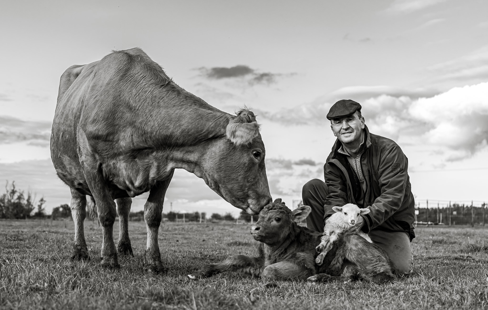

**Kiss Sándor** vagyok, és én csinálom ezt a komposztot a mezőtúri családi gazdaságunkban.

Agrármérnök vagyok. Húsz évig dolgoztam multinál: agronómusként kezdtem, üzemvezetőként, végül termelési igazgatóként folytattam. 2016-ban otthagytam a multit, és visszaköltöztem a földre.

Azóta ezt csinálom. És sokkal jobban szeretem, mint az irodát.

## Egy kicsit rólam

- **Agrármérnöki diplomám van.** Tudom, mit jelent az NPK, és azt is, miért nem csak ez a fontos.
- **20 évig dolgoztam egy nagy multi agrárcégnél.** Agronómusként kezdtem, aztán üzemvezető lettem, végül termelési igazgató. Vetőmagot, növényvédőt, technológiát adtunk el gazdáknak.
- **2016-ban elegem lett.** Pontosabban: rájöttem, hogy amit ott csináltunk, az nem ugyanaz, mint amit otthon szerettem volna csinálni. Otthagytam a multit, elindítottam a saját farmgazdaságomat.
- **Tíz év alatt felépítettünk valamit, amire büszke vagyok.** 22 angus és wagyu marha, 20+ dorper anyajuh, sok bárány, 50-150 csirke évszaktól függően, időnként kacsák, egy komondor és egy komondor-kuvasz keverék kutya.
- **Körülbelül 80 hektáron gazdálkodunk.** Bio kukoricát termesztünk étkezésre és takarmányra, mellette búzát, bükkönyt és egy csomó más kultúrát is.
- **Minden földünk bio-tanúsított.** Semmilyen vegyszert nem használunk, sehol.
- **Regeneratív gazdálkodást csinálunk.** Ez azt jelenti, hogy nem csak nem ártunk a talajnak, hanem évről évre javítjuk. Több szervesanyag, több élet, több víztároló képesség.
- **Folyamatosan kísérletezem új fajtákkal és növényekkel.** Magyarország szárazabb lesz, és muszáj alkalmazkodni. Aki most úgy csinál mindent, mint 20 éve, az 10 év múlva nem lesz versenyképes.
- **Öt gyerekem van.** A három nagyobb évek óta segít a gazdaságban. Egyikük csinálja most ezt az online értékesítést, amit éppen olvasol. A két kicsi, 3 és 6 évesek, még csak úgy tesznek, mintha segítenének, de már most jobban szeretik a teheneket, mint a tévét.

## Miért árulunk komposztot?

Egyszerű ok: 22 marha + 20 juh + 100 csirke = sok szar.

Komolyabb ok: ha már egyszer kiderült, hogy a saját trágyánkból olyan komposzt készíthető, ami élőbb, tisztább és tápanyagdúsabb, mint bármi a boltban, akkor miért ne osztanánk meg?

A boltban kapható komposzt nagy része ipari feedlotokból jön. Antibiotikummal kezelt állatok trágyájából. GMO-takarmányról. A miénk bio-tanúsított legelőkről, fűvel etetett állatoktól, saját bio gabonával hizlalva.

Más a forrás. Más a végeredmény.

És tessék, ezt akarjuk eladni neked.

[Megrendelem](termek.html)

📍 5400 Mezőtúr, Felsőrészinyomás 105. | 📞 +36 39 4596 9764
